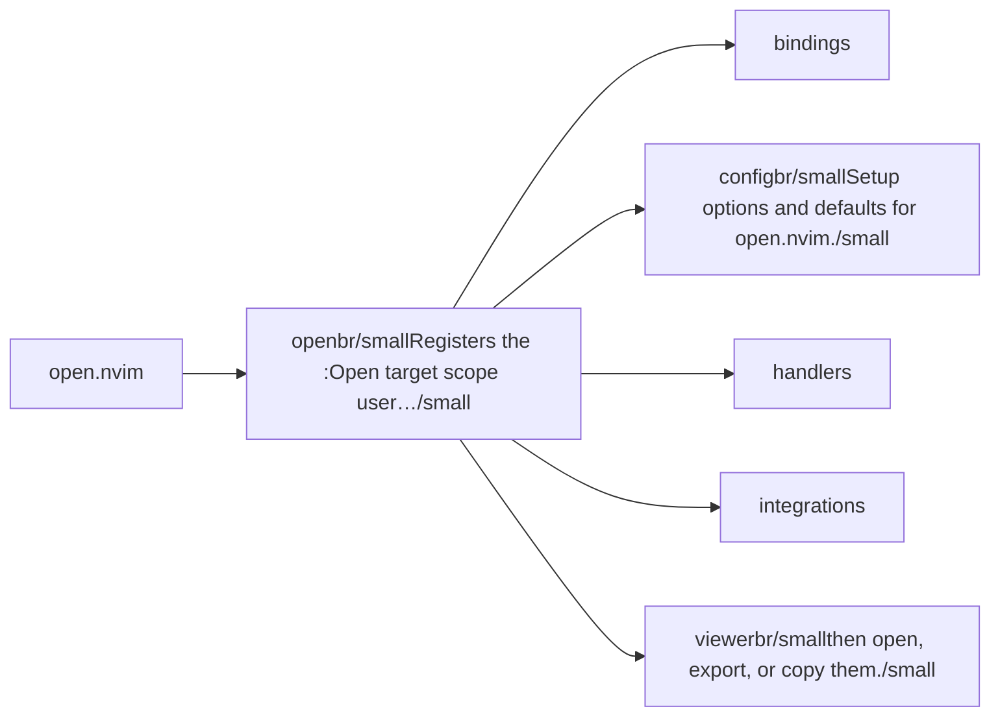
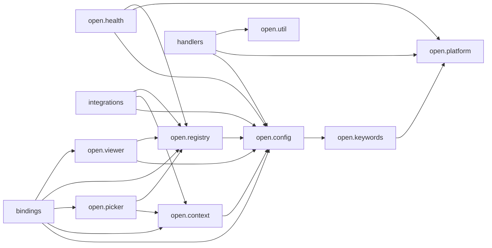

# open.nvim — module map

> **Generated** by `documentation`. Do not edit by hand — run `:DocMap`
> (or `nvim --headless -l scripts/gen_map.lua`) to regenerate.

**3 modules** · 4 namespaces · 21 helper files

The [interactive map](index.html) has filtering, full descriptions and
source links; this page is the version the code host renders directly.

## Namespaces

## Dependencies

Which parts of the tree require which, rolled up to the second level.
The [interactive map](index.html)'s **Deps** view has this per module,
in both directions, with load-time and lazy requires told apart.

## Modules

| Module | Description | Fns | Docs |
|---|---|---|---|
| `open` | Registers the :Open [target] [scope] user command with tab-completion over the registered handler names (1st arg) and explicit scope tokens (2nd arg). | 2 | [src](../../lua/open/init.lua) |
| &nbsp;&nbsp;`bindings` |  |  |  |
| &nbsp;&nbsp;`open.config` | Setup options and defaults for open.nvim. | 3 | [src](../../lua/open/config/init.lua) |
| &nbsp;&nbsp;`handlers` |  |  |  |
| &nbsp;&nbsp;`integrations` |  |  |  |
| &nbsp;&nbsp;`open.viewer` | then open, export, or copy them. | 14 | [src](../../lua/open/viewer/init.lua) |

## Drift

0 errors · 0 warnings · 13 info

No errors or warnings.

13 informational findings

| Check | Message |
|---|---|
| `missing-readme` | lua/open has no README.md |
| `missing-readme` | lua/open/config has no README.md |
| `missing-readme` | lua/open/viewer has no README.md |
| `unreferenced-module` | open.handlers.browser is required by no other file in the tree |
| `unreferenced-module` | open.handlers.default is required by no other file in the tree |
| `unreferenced-module` | open.handlers.filemanager is required by no other file in the tree |
| `unreferenced-module` | open.handlers.image is required by no other file in the tree |
| `unreferenced-module` | open.handlers.notepad is required by no other file in the tree |
| `unreferenced-module` | open.handlers.nvim_internal is required by no other file in the tree |
| `unreferenced-module` | open.handlers.terminal is required by no other file in the tree |
| `unreferenced-module` | open.health is required by no other file in the tree |
| `unreferenced-module` | open.integrations.telescope is required by no other file in the tree |
| `unreferenced-module` | open.integrations.urlview is required by no other file in the tree |

